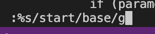
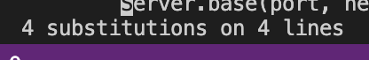
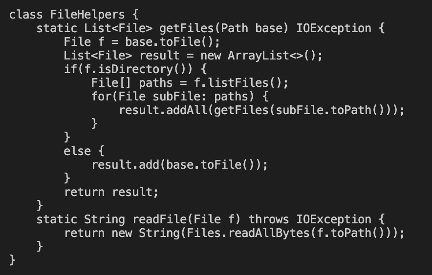
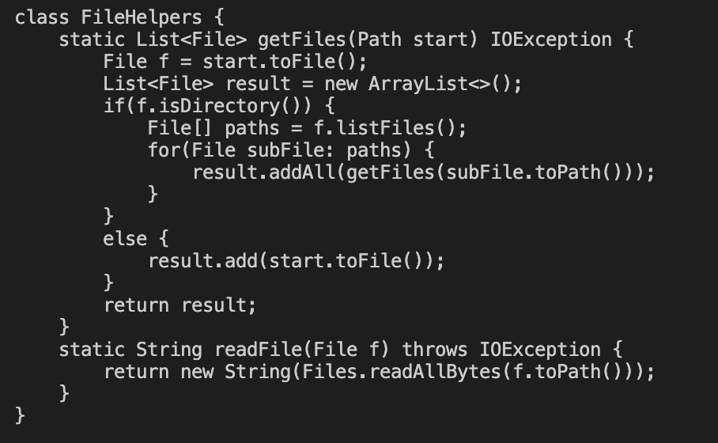

Kayla Mochizuki
# Lab Report 4
---
## Part 1: Changing the name of the start parameter and its uses to base

<:> <%> s </> s t a r t </> b a s e g <enter>
<:> w q <enter>

total commands = 20
  

- this command changes all "start"s in the DocSearchServer.java to "base"
 

 
- this shows that the "start"s were in facts changed to "base"
  

  
- this shows the changes made to to static method List

  original code for the method:
 
  

- this command saves the changes made to the file

