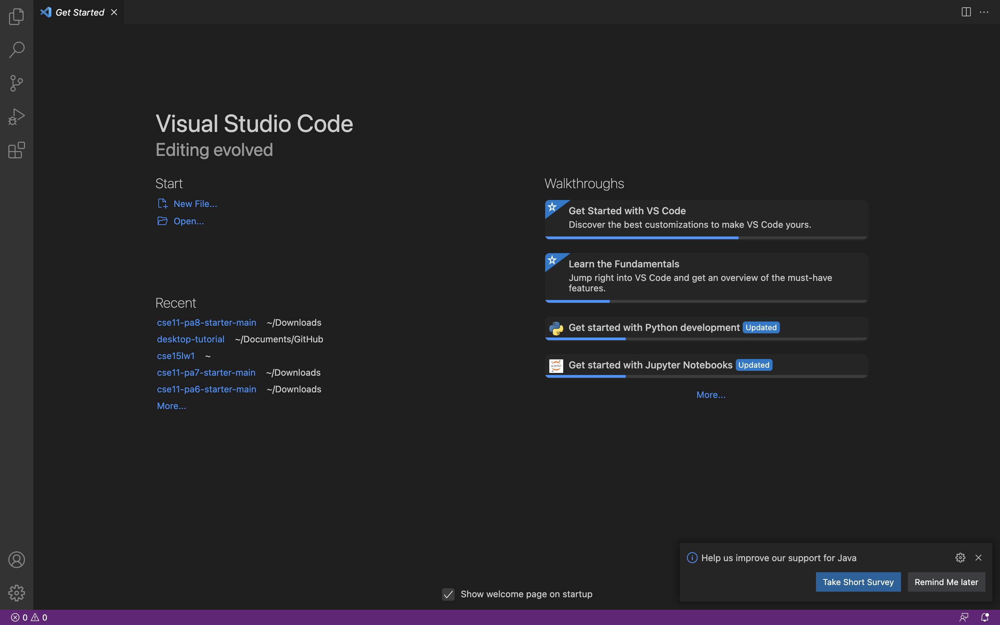
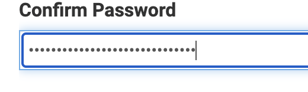
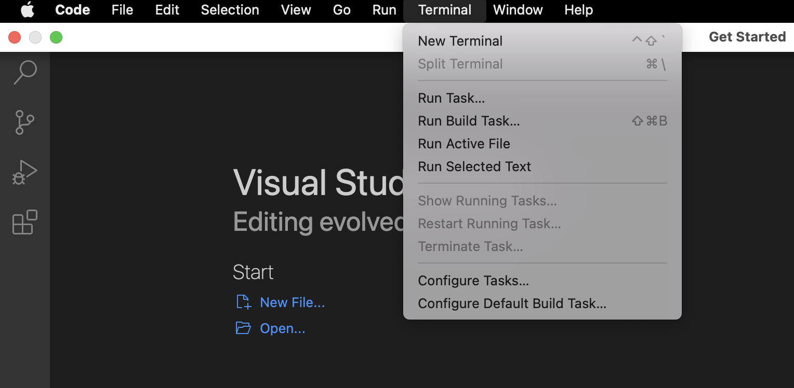
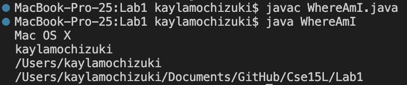
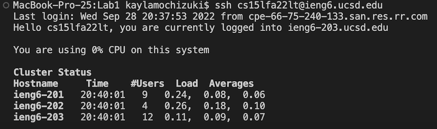
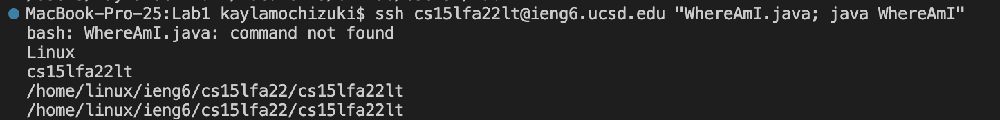

Kayla Mochizuki 
A02
A16763664
## **Week 1 Lab Report**

This is a tutorial on how to log into a course specific account remotely using ieng.

## PART 1: Install VScode

Link: https://code.visualstudio.com/download

- Download the correct version for your computer

- After downloading, your VScode should appear similarly to the one above

## PART 2: Remotely Connecting

- Before remotely connecting, you must first change your password for cse15 using this link: https://sdacs.ucsd.edu/~icc/index.php 
	- After logging into your account, click under “Additional Accounts” the one for cs15l

- Now, click on “change your password”
	- Importance Notes when changing your password:
		- Once at the password change request, enter your current password which should be the one you use in MyTritionLink
		- Once you have entered the information, DO NOT press the blue button at the bottom of the page, “Check Password”
		- If you do not want to change the password you use in MyTritonLink, make sure to switch it to “No”
		- If you have done the above, position your cursor at the end of your confirm password and click return/enter

- Your password change may take 15 minutes to process before you are able to try connecting remotely

- To begin Remotely connecting, open a terminal

- Type in the command: ssh coursespecific_accountname@ieng.ucsd.edu
	- Your course specific account name can be found through this link: https://sdacs.ucsd.edu/~icc/index.php 
	- Under “Additional Accounts” the one for cse15l is your username

Notes:
	- If you are prompter with a yes or no question, choose yes
	- If your password doesn’t work, try again to make sure you typed it in correctly
	- If you still can’t login and 15 minutes have passed, try using instead of your course specific username, your MyTritonLink username

- If you still can’t login after following the instructions above, try waiting a bit more and then change your password again (this is the way I fixed mine the first time)

- You will then be prompted to type in your password
	- This should be the one you just made
	- When typing in your password it will look like this nothing is happening on your screen, however even though you can’t see it happening, you are typing in your password

## PART 3: Trying Some Commands

- To make a new directory, use: mkdir 
	- To name the directory: mkdir name_you_want
		- ex) if you want your directory name to be hello, write: mkdir hello
- To look at all the files in the directory, use: ls
- To find what file you are currently in, use: pwd
- To change what file you are currently located in, use: cd
- To print out the contents of a file, use: cat file_name

## PART 4: Moving files with scp
	
- If you are currently Remotely connect:
	- In your terminal control + D to logout

- You should now be working locally
- Create a WhereAmI.java file with the following code:

class WhereAmI {
  public static void main(String[] args) {
    System.out.println(System.getProperty("os.name"));
    System.out.println(System.getProperty("user.name"));
    System.out.println(System.getProperty("user.home"));
    System.out.println(System.getProperty("user.dir"));
  }
}
	
- In your terminal write the following commands:
	
- Now using scp, in your terminal write: scp WhereAmI.java coursespecific_accountname@ieng.ucsd.edu:~/
	- When prompted, type in password
- You will then relogin to the remote computer using ssh the same way that was done earlier
- Using ls, you will now see that WhereAmI is in your directory
	
## PART 5: Setting a SSH key
	
- If you are currently Remotely connect:
	- In your terminal control + D to logout

- You should now be working locally
- In your terminal write the command: ssh-keygen
- Your terminal should now have "Enter file in which to save the key" with something in parentheses following
	- you will then copy the part in parentheses and paste it into your terminal
	- OR
	- you can simply press enter on your keyboard 
	 	- this created a private and public file (the public file is the one with .pub)
- Now, remotely connect using the same method used earlier
- In your terminal, write: mkdir .ssh
- Logout using control + D
- In your terminal write: scp public_file_name coursespecific_accountname@ieng.ucsd.edu:~/.ssh/authorized_keys
- You now will no longer need to enter a password when loging in remotely
	
	
	
## PART 6: Optimizing Remote Running

Some useful shortcuts to use when working remotely:
	
	- writing a command in quotes will run it directly
	- you can use semicolon to run commands on one line
	- ex)
		

	

