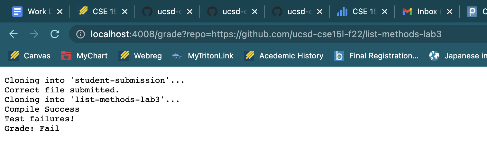
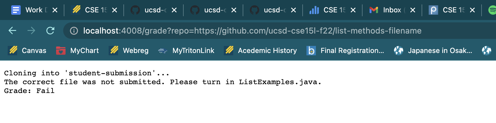
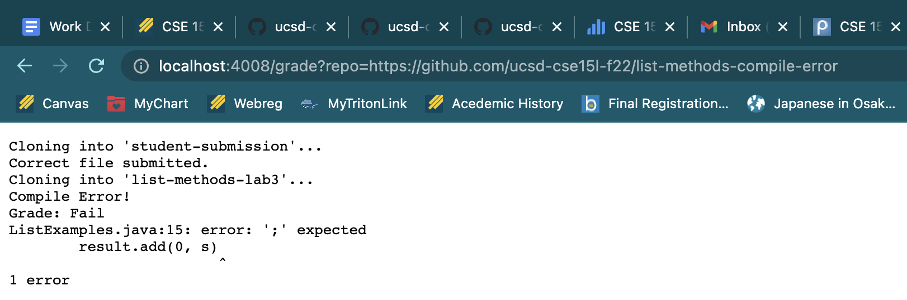

Kayla Mochizuki
# Lab Report 5
---
## grade.sh

```
rm -rf student-submission
git clone $1 student-submission

FILE=student-submission/ListExamples.java
if [[ -f "$FILE" ]] ; then
echo "Correct file submitted."
else 
echo "The correct file was not submitted. Please turn in ListExamples.java."
echo "Grade: Fail"
    exit 1
fi

rm -rf testing
mkdir testing
mv $FILE testing
cd testing
git clone https://github.com/ucsd-cse15l-f22/list-methods-lab3

if javac ListExamples.java 2> error.txt;
then
    echo "Compile Success"
    javac -cp .:../lib/hamcrest-core-1.3.jar:../lib/junit-4.13.2.jar *.java
    
    if java -cp .:lib/hamcrest-core-1.3.jar:lib/junit-4.13.2.jar org.junit.runner.JUnitCore TestListExamples 2> errors.txt > output.txt;
	then
		  echo "All tests passed!"
          echo "Grade: Pass"
	else
		  echo "Test failures!"
          echo "Grade: Fail"
          cat output.txt
            exit 1
    fi
else 
    echo "Compile Error!"
    echo "Grade: Fail"
    echo "$(cat error.txt)"
        exit 1
fi
```

---
## Examples of running grade.sh in the browser

Example 1)



Example 2)



Example 3)



---
## Trace of Example 2

- line 5: If there already exists a student-submission, it gets deleted. The standard output is that the student-submission will be deleted. There is no standard error since if there exists no student-submission already, rm -rf does nothing. This was a zero return code because it ran successfully.

- line 6: Clone in the file the student is submitting. The standard output is that the file will be cloned. The standard error is "bash: grade.sh: No such file or directory". This was a zero return code because it ran successfully.

- line 9: Checks if the submitted student-submission contains ListExamples.java. In this case, the if statement is false so the code goes into the else statement starting on line 11. The standard output is that the if statement will run to see if true, ListExamples.java does exist or false, ListExamples.java does not exist. There is no standard output because the if statement does its job silently. This was a zero return code because it ran successfully.  

- line 12: Echo prints out the message, “The correct file was not submitted. Please turn in ListExamples.java.”. The standard output is that echo prints the message in quotes. There is no standard error for echo. This was a zero return code because it ran successfully.  

- line 13: Echo prints out the message, “Grade: Fail”. The standard output is that echo prints the message in quotes. There is no standard error for echo. This was a zero return code because it ran successfully.  

- line 14: The bash script is exitted. Exit 1 forces a non zero return. The standard output is exiting the bash script. There is no standard error for exit 1.
