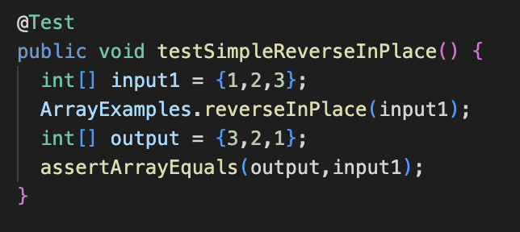
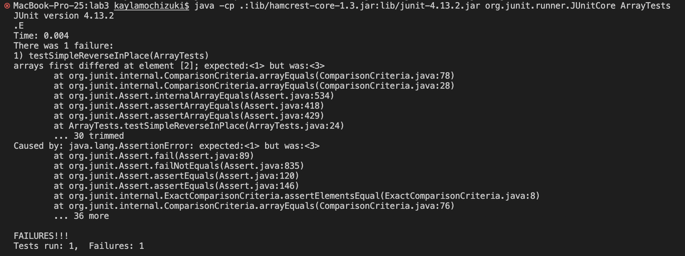
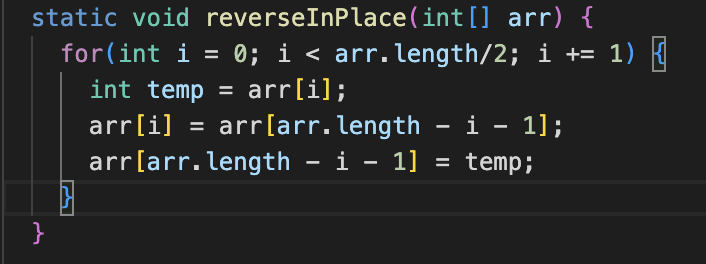
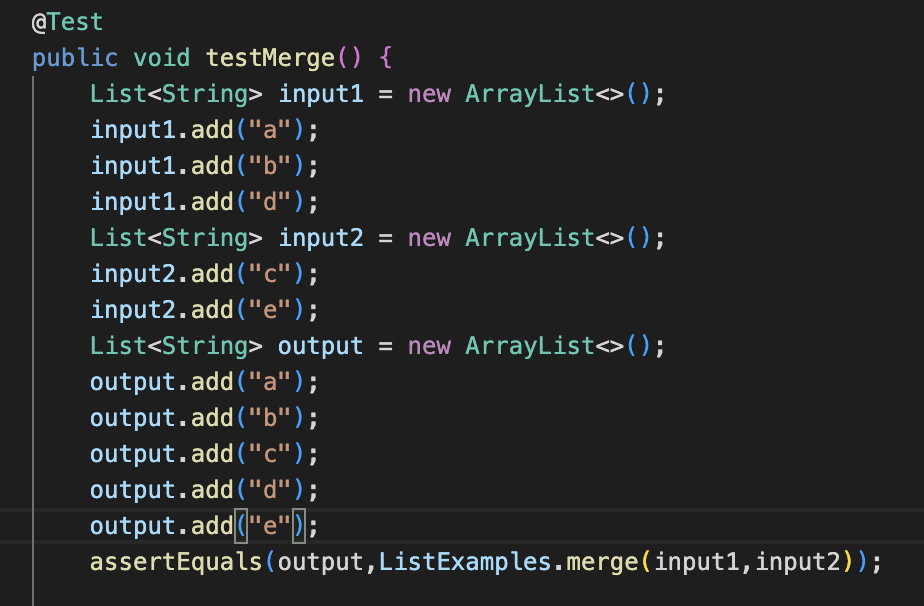
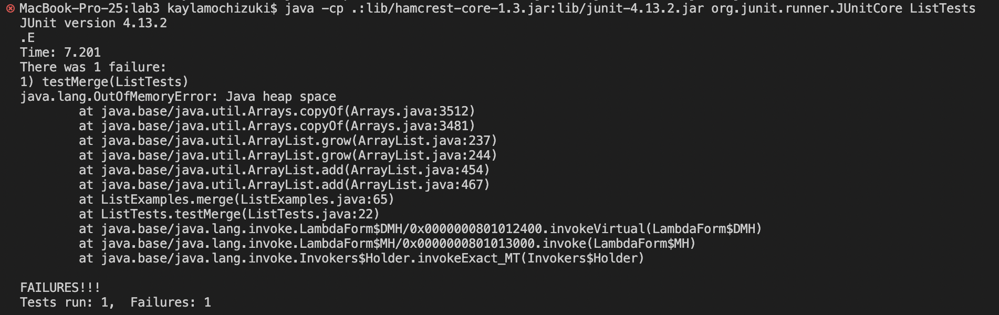
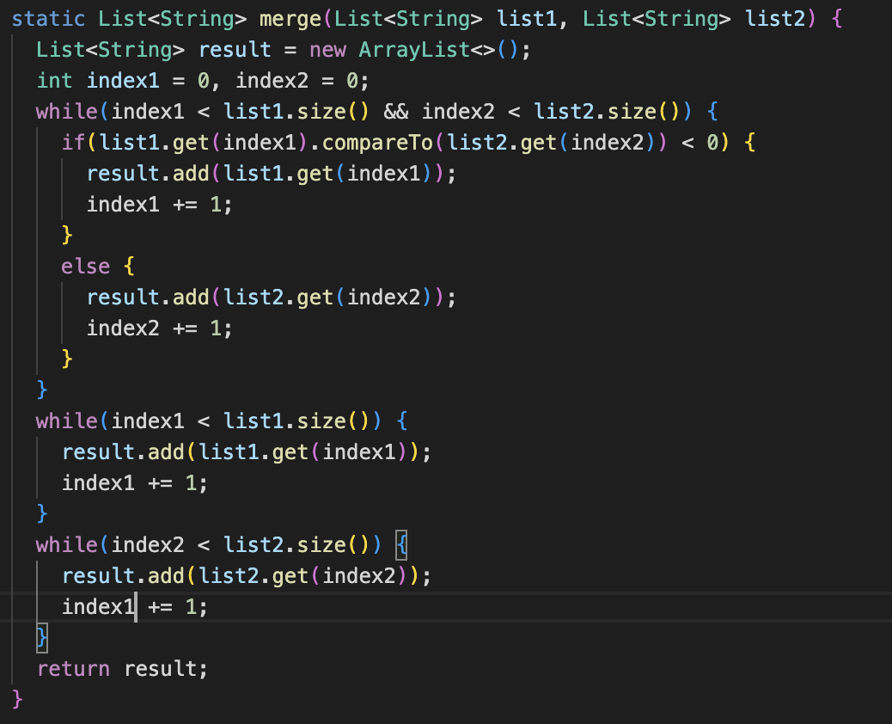
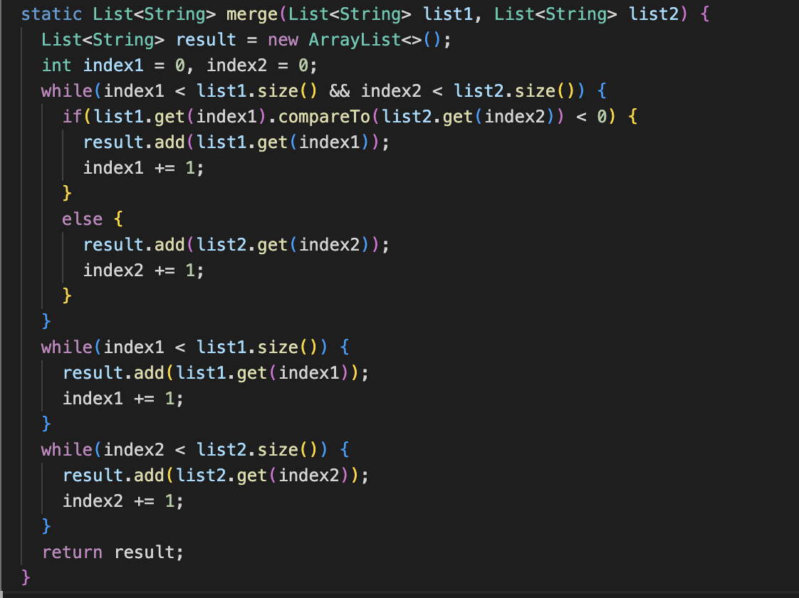

Kayla Mochizuki 

# WEEK 3 LAB REPORT 2

---

## Part 1

**Simplest Search Engine:**
```
import java.io.IOException;
import java.net.URI;
import java.util.ArrayList;

class Handler implements URLHandler {
    ArrayList alst = new ArrayList();

    public String handleRequest(URI url) {
        if (url.getPath().contains("/add")) {
            String[] parameters = url.getQuery().split("=");
            if (parameters[0].equals("s")) {
                alst.add(String.valueOf(parameters[1]));
            }
            return "added!";
        }
        if (url.getPath().contains("/search")) {
            String[] parameters = url.getQuery().split("=");
            String s = "";
            if (parameters[0].equals("s")) {
                for(int i = 0; i < alst.size(); i++) {
                    String use = String.valueOf(alst.get(i));
                    if(use.contains(String.valueOf(parameters[1]))) {
                        s += use+ " ";
                    }
                }
                return s;
            }
        }
        return "404 Not Found!";
    } 

         
}


class SearchEngine {
    public static void main(String[] args) throws IOException {
        if(args.length == 0){
            System.out.println("Missing port number! Try any number between 1024 to 49151");
            return;
        }

        int port = Integer.parseInt(args[0]);

        Server.start(port, new Handler());
    }
}
```


- my method handleRequest is being called
- the relevent argument to my method is the URL which in this case is localhost:4002/add?s=pineapple
- the argument "pineapple" is added to alst once SearchEngine is done processing


- my method handleRequest is being called
- the relevent argument to my method is the URL which in this case is localhost:4002/add?s=apple
- the argument "apple" is added to alst once SearchEngine is done processing


- my method handleRequest is being called
- the relevent arguments to my method is localhost:4002/search?s=app
- none of the arguments are changed once SearchEngine is done processing


---

## Part 2

**Bug 1 From ArrayExamples: method reverseInPlace**

Failure inducing input:



Symptom(actual output): 



Expected: 
```
{3,2,1}
```
Bug: The for loop is trying to change the elements one at a time. I had to make it where the elements on opposite sides would switch with each other, so I would be changing two elements at a time.


Fixed Code:



Correlation: Once the for loop tried to change the later half of the array, the first halves elements are already changed, so the later halves elements will stay the same. This means that instead of the values flipping, only one side is changing it's value.

---

**Bug 2 From ListExamples: method merge**

Failure inducing inputs:  



Symptom(actual output): 



Expected:
```
["a","b","c","d","e"]
```
Bug: The index1 count was counting in places it shouldn't be. In the 3rd while loop in the code it should've been adding 1 to index2 but was instead adding 1 to index1.



Fixed Code:




Correlation: Because index2 was not being added, the while loop countinued running because it never reached the condition for it to end.


